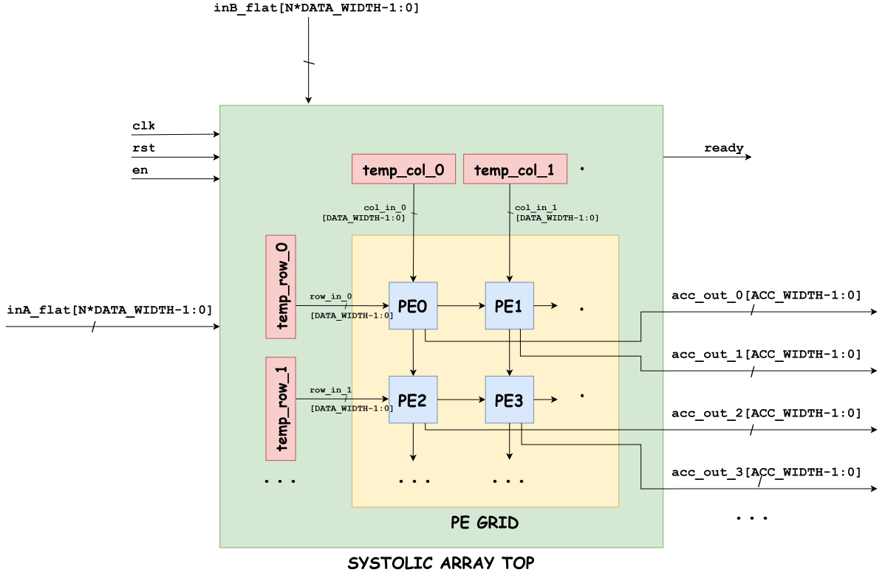

# PARAMETERIZED SYSTOLIC ARRAY FOR MATRIX MULTIPLICATION


## 1. Introduction
**Systolic Array** is an architecture that consists of multiple processing units (PEs). These PEs operate simultaneously and pass data to their neighbors, forming a system that works rhythmically. In this project, we implement a parameterized matrix multiplier using systolic workflow, featuring N x N Multiply-Accumulate (MAC) processing elements. This design allows total operating time to decrease significantly compared to sequential methods. Additionally, the module is scalable for further projects that require N x N matrix multiplication.

--- 

## 2. Architecture Overview

### 2.1. Hierarchy Design
The hierarchy design is divided into 3 levels:



### 2.2. Signal and Parameter specification
| Signal Name | Width | Description |
| :--- | :---: | :--- |
| `clk` / `rst`/`en` | 1-bit | Global clock, active-HIGH synchronous reset, and active-HIGH enable signal. |
| `ready` | 1-bit | End of execution flag. |
| `inA_flat` / `inB_flat` | N * N * DATA_WIDTH | Input matrices, flattened into a little-endian vector. |
| `result_out` | N * N * ACC_WIDTH | Resulting matrix, flattened into a little-endian vector. |

| Parameter Name | Value | Description |
| :--- | :---: | :--- |
| `N` | 2, 4, 16,... | Matrix size. |
| `DATA_WIDTH` | 8, 16,... | Entries bit width. |
| `ACC_WIDTH` | 2 * DATA_WIDTH + $clog2(N) | Results bit width. |

### 2.3. System Workflow
The top module controls the whole execution following these steps:
1. Receive `en` signal, clear current results, load input matrices into each row/col data registers with designated order. Higher-indexed rows/cols wait for the previous to enter the array.
2. Execution begins and data starts flowing. Each PEs multiplies, accumulates and passes data to the next one, from upper left to lower right.
3. Internal `counter` variable increments after each clock cycle until reaching *3N + 1*. Afterwards, it resets back to zero, `ready` signal goes high to indicate that output matrix is available.
4. The system comes to IDLE state, waiting for the next multiplication to be enabled.

The table below summerizes the operations during each cycle.

| `counter` | Action | Data Input State | `clr` | `ready` |
| :---: | :--- | :--- | :---: | :---: |
| *0* | **IDLE** | Wait for `en` signal | `1'b0` | `1'b1` |
| *1* | **Latch & Skew** | Latch inputs; assert `clr` | `1'b1` | `1'b0` |
| *2 -> 3N* | **Compute & Shift** | Shift `temp_row` and `temp_col` into PE grid | `1'b0` | `1'b0` |
| *3N + 1* | **Done** | Last accumulation; reset counter; assert `ready` flag | `1'b0` | `1'b0` |

---

## 3. Code Tree

```text
parameterized-systolic-array/
├── RTL/
│   ├── systolic_array_top.v                    
│   ├── pe_grid.v
│   └── pe.v
├── Testbench/                             
│   ├── systolic_array_2x2_tb.v
│   ├── systolic_array_4x4_tb.v
│   ├── systolic_array_16x16_tb.v
│   ├── grid_tb.v
│   └── pe_tb.v
├── Figure/
│   └── hierarchy.svg
├── Waveform/
│   ├── top_waveform.png
│   ├── grid_waveform.png
│   └── pe_waveform.png
├── .gitignore                  
└── README.md
```

---

## 4. Verification Workflow


| Test ID | Test Name | Verification Objective | Input Vectors ($A \times B$) | Expected Output ($C$) | Status |
| :---: | :--- | :--- | :--- | :--- | :---: |
| **TC_01** | Reset Signal | Verifies hardware reset clears all internal registers and outputs. | $A = [[1, 2], [3, 4]]$<br>$B = [[0, 1], [1, 0]]$, `rst=1` | $C = [[0, 0], [0, 0]]$ | `PASSED` |
| **TC_02** | Basic Matrices | Validates standard 2x2 matrix multiplication. | $A = [[1, 2], [3, 4]]$<br>$B = [[4, 3], [2, 1]]$ | $C = [[8, 5], [20, 13]]$ | `PASSED` |
| **TC_03** | Zero Matrix | Verifies zero property <br>($A \times 0 = 0$). | $A = [[1, 2], [3, 4]]$<br>$B = [[0, 0], [0, 0]]$ | $C = [[0, 0], [0, 0]]$ | `PASSED` |
| **TC_04** | Identity Matrix | Verifies identity matrix property <br>($A \times I_2 = A$). | $A = [[1, 2], [3, 4]]$<br>$B = [[1, 0], [0, 1]]$ | $C = [[1, 2], [3, 4]]$ | `PASSED` |
| **TC_05** | Inverse Matrix | Validates inverse matrix property and 2's complement negative values <br>($A \times A^{-1} = I_2$). | $A = [[1, 2], [2, 3]]$<br>$B = [[-3, 2], [2, -1]]$ | $C = [[1, 0], [0, 1]]$ | `PASSED` |
| **TC_06** | Enable Signal | Tests `en` disable logic mid-execution to ensure input latching integrity. | Ignores input updates when `en=0` (`ready` low) | Retains $C = [[1, 0], [0, 1]]$ | `PASSED` |
| **TC_07** | Maximum Value | Verifies 17-bit accumulator overflow protection with max INT8 positive values (`+127`). | $A = [[127, 127], [127, 127]]$<br>$B = [[127, 127], [127, 127]]$ | $C = [[32258, 32258], [32258, 32258]]$ | `PASSED` |
| **TC_08** | Minimum Value | Tests sign-extension and accumulator range with min INT8 negative values (`-128`). | $A = [[-128, -128], [-128, -128]]$<br>$B = [[-128, -128], [-128, -128]]$ | $C = [[32768, 32768], [32768, 32768]]$ | `PASSED` |
| **TC_09** |  |  | | | `PASSED` |
| **TC_10** |  |  |  |  | `PASSED` |

---

## 5. Performance & Complexity Analysis

For an N x N matrix multiplication, the systolic array trades spatial area (N^2 PEs) for linear runtime latency O(N).

| Metric | Sequential (Single MAC) | Fully Combinational | Systolic Array |
| :--- | :---: | :---: | :---: |
| **Compute Latency** | N^3 | 1 | **3N + 1** |
| **Resource Complexity** | 1 MAC | N^3 MACs | **N^2 PEs** |
| **Interconnect Locality** | Global | High Fan-out / Global | **Local Nearest-Neighbor** |
| **Critical Path (f_MAX)** | High | Very Low | **High (Pipelined PEs)** |
| **Time Complexity** | O(N^3) | O(1) | **O(N)** |

### Latency & Speedup Analysis

| Dimension (N x N) | PEs (N^2) | Total Latency (Cycles) | Speedup vs. Sequential (N^3 / (3N+1)) |
| :---: | :---: | :---: | :---: |
| **2 x 2** | 4 | 7 cycles | **1.14x** |
| **4 x 4** | 16 | 13 cycles | **4.92x** |
| **8 x 8** | 64 | 25 cycles | **20.48x** |
| **16 x 16** | 256 | 49 cycles | **83.59x** |

---

## 6. Synthesis Results

* Target board: Arty Z7-20
* Stage: Post-Implementation
* Synthesis mode: Out-of-Context (OOC)

| Metric | 2×2 Array (4 PEs) | 4×4 Array (16 PEs) | 16×16 Array (256 PEs) |
| :--- | :--- | :--- | :--- |
| **Slice LUTs** | 385 (0.72%) | 1,420 (2.67%) | 23,132 (43.48%) |
| **Slice Registers (FFs)** | 239 (0.22%) | 1,029 (0.97%) | 17,670 (16.61%) |
| **DSPs (DSP48E1)** | 0 (0.00%) | 0 (0.00%) | 0 (0.00%) |
| **Block RAM (RAMB36/18)** | 0 (0.00%) | 0 (0.00%) | 0 (0.00%) |
| **Worst Negative Slack (WNS)** | +3.402 ns | +2.998 ns | +1.392 ns |
| **Maximum Frequency ($F_{\max}$)** | 151.56 MHz | 142.82 MHz | 116.17 MHz |
| **Dynamic Power** | 0.006 W | 0.024 W | 0.348 W |
| **Total On-Chip Power** | 0.109 W | 0.126 W | 0.456 W |
| **Junction Temperature** | 26.3 °C | 26.5 °C | 30.3 °C
---

## 7. Demo instruction

This project includes unit testbenches for PE, PE grid, and three top-level testbenches running all testcases. Test results are automatically verified via terminal and signals can be tracked from waveform.

### Prerequisites

* **AMD/Xilinx Vivado**
* **Git**
---

### Step 1: Clone the Repository

Open your terminal or command prompt and clone the repository:

```bash
git clone https://github.com/nhatnamhuynh/parameterized-systolic-array.git
cd parameterized-systolic-array
```

---

### Step 2: Set Up the Vivado Project

1. Launch **Vivado**.
2. Click **Create Project** -> Name your project and click **Next**.
3. Select **RTL Project** (leave *Do not specify sources at this time* unchecked).
4. **Add Source Files:**
   * Click **Add Files** and select all `.v` files inside the `RTL/` directory (`pe.v`, `pe_grid.v`, `systolic_array_top.v`).
   * Set `systolic_array_top.v` as the Top Module.
5. Select your target FPGA board/part and click **Finish**.
6. **Add Simulation Sources:** In the Vivado **Sources** panel, expand **Simulation Sources** -> Right-click the `sim_1` -> **Add Sources...**.
   * Click **Add Files** and select all `.v` files inside the `Testbench/` directory (`pe_tb.v`, `pe_grid_tb`, `systolic_array_2x2_tb.v`, `systolic_array_4x4_tb.v`, `systolic_array_16x16_tb.v`).

---

### Step 3: Run Unit Tests

To test individual modules:

1. In the Vivado **Sources** panel, expand **Simulation Sources** -> `sim_1`.
2. Right-click the desired module testbench (e.g., `pe.v`) and select **Set as Top**.
3. In the left Flow Navigator, click **Run Simulation** -> **Run Behavioral Simulation**.
4. Check the **Tcl Console**:
   * Inspect the `if/else` print statements verifying module outputs against expected values.
5. Inspect the **Waveform Window** to verify signal timings, state transitions, and flag assertions.

---

### Step 4: Run Top-level Tests

To verify complete execution across the entire pipeline:

1. In **Simulation Sources**, right-click `systolic_array_2x2_tb.v` and select **Set as Top**.
2. Click **Run Simulation** -> **Run Behavioral Simulation**.
3. Observe the **Tcl Console Output**:
   * Review the terminal output logs for pass/fail status.
4. **Inspect Waveforms:**
   * Key signals to add to the Waveform viewer: `clk`, `rst`, `clr`, `ready`, `inA_flat`, `inB_flat`, `result_out`.